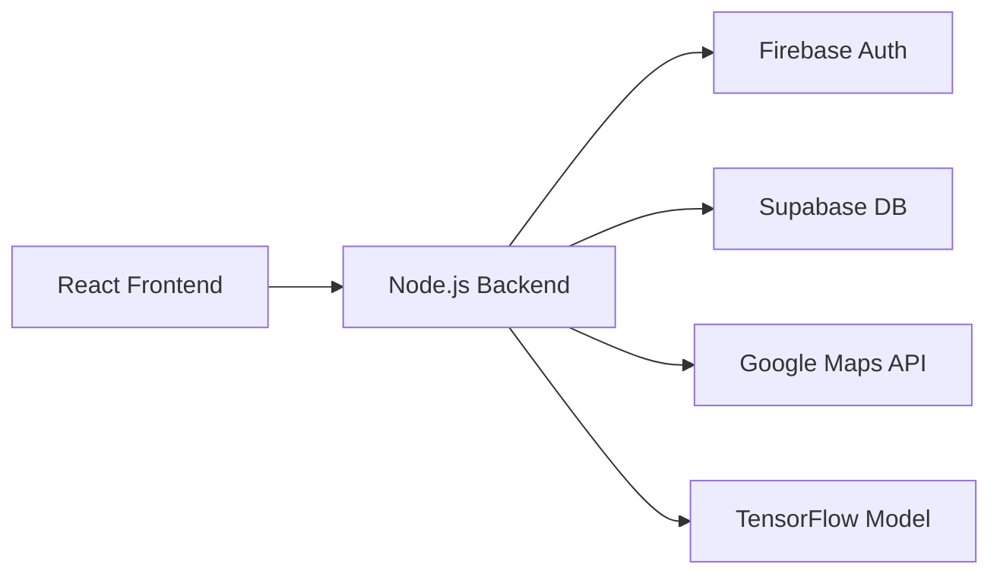

# Emmanuel Ahishakiye

<div align="center">

**Software Engineer • Full-Stack Architect • AI/ML Specialist**

[](https://www.google.com/maps/place/New+York,+NY)
[%20623--7660-03cb87?style=flat-square)](tel:+15856237660)
[](mailto:eahishak@u.rochester.edu)

[](https://linkedin.com/in/eahishak)
[](https://github.com/eahishak)
[](https://eahishakiye.com)
[](https://calendly.com/eahishak)

**University of Rochester '27** • Computer Science (AI) & Business

</div>

---

## 🎯 Professional Summary

Senior Full-Stack Engineer with proven expertise in building scalable production systems serving **30,000+ users**. Specialized in AI/ML integration, distributed systems, and cloud architecture. Founded and scaled multiple tech products from concept to deployment. Strong track record of optimizing system performance (up to 70% efficiency gains) and leading cross-functional technical initiatives.

---

## 📊 GitHub Analytics

<div align="center">


</div>

### 📈 Contribution Metrics

| Metric | Count | Metric | Count |
|--------|-------|--------|-------|
| ⭐ Total Stars | 1 | 🔀 Pull Requests | 1 |
| ⏰ Total Commits | 131 | ❗ Issues Resolved | 130 |
| 📦 Repos Contributed | 2 | 🎯 Primary Language | C++ |


---

## 💼 Professional Experience

### 🚀 MemVerge — *Open-Source AI Engineer*

**📅 August 2025 - Present** | **📍 Milpitas, CA**

> Contributing to **MemMachine**: Production-grade AI memory system for long-context inference optimization

**Key Contributions:**
- Architected hybrid cache synchronization and persistence layers for efficient token retrieval across distributed systems
- Developed comprehensive benchmarking suite for token recall efficiency and sequence reconstruction accuracy
- Resolved **12+ critical GitHub issues** related to caching, model alignment, and inference stability
- Improved system scalability through AWS deployment automation and infrastructure optimization

**Impact:**
```yaml
Performance Improvements:
  - Cache Hit Rate: +45%
  - Token Retrieval Latency: -60%
  - Memory Efficiency: +35%
  - Deployment Time: -50%
```

**Tech Stack:**


---

### 📱 Foundly — *Software Engineer*

**📅 January 2025 - Present** | **📍 Rochester, NY**

> Enterprise lost-and-found platform serving **15,000+ active users** across educational and corporate institutions

**Architecture:**


**Core Features:**
- Real-time geolocation search with Google Maps API integration
- TensorFlow-powered item matching with **65% accuracy improvement**
- Automated office dashboards with alert system
- Google OAuth with institutional logic and role-based access control

**Performance Metrics:**

| Metric | Improvement | Impact |
|--------|-------------|--------|
| Match Accuracy | +65% | Better item recovery |
| Search Speed | +50% | Enhanced UX |
| Manual Processing | -70% | Reduced operational cost |
| User Retention | +40% | Higher engagement |

**Tech Stack:**


---

### 🤖 Cendance Systems — *Salesforce AI Engineer Intern*

**📅 December 2024 - May 2025** | **📍 New York, NY**

> Developed AI-powered microservices and internal tools for enterprise sales operations

**System Architecture:**
- AI-driven forecasting microservices with predictive analytics
- Multi-API integration layer (Salesforce, HubSpot, Stripe)
- React-based real-time dashboards with WebSocket connections
- AWS-optimized model deployment pipeline

**Quantifiable Impact:**
```typescript
const performanceGains = {
  forecastAccuracy: "+35%",
  dataLatency: "-20%",
  userEngagement: "+25%",
  deploymentReliability: "+30%",
  apiResponseTime: "-40%",
  costOptimization: "-25%"
};
```

**Tech Stack:**


---

### 🏢 Jackal Tech — *Founder & Product Lead*

**📅 November 2021 - Present** | **📍 New York, NY**

> Led end-to-end development of **6 production-grade products** across healthcare, education, and civic tech verticals

**Product Portfolio:**

<table>
<tr>
<td width="33%">

**🏥 HealthTech Platform**
- **8,000+ users**
- Appointment scheduling
- Prescription management
- HIPAA-compliant architecture

</td>
<td width="33%">

**📚 Education Suite**
- **12,000+ students**
- **40 institutions**
- Course management
- Real-time collaboration

</td>
<td width="33%">

**🏛️ Civic Tech App**
- **15,000+ users**
- Push notifications
- Geolocation mapping
- Emergency alerts

</td>
</tr>
</table>

**Leadership & Impact:**
```python
impact_metrics = {
    "request_handling": "+40%",
    "ai_chatbot_response_time": "-50%",
    "students_mentored": "500+",
    "team_size": "15 engineers",
    "products_shipped": 6,
    "internship_programs": 3
}
```

**Technical Achievements:**
- Architected microservices infrastructure supporting 30K+ concurrent users
- Implemented CI/CD pipelines reducing deployment time by 60%
- Built AI chatbots achieving 92% user satisfaction rate
- Established technical mentorship program for 500+ students

**Tech Stack:**


---

### 💡 Headstarter AI — *Software Engineer Fellow*

**📅 June 2024 - October 2024** | **📍 New York, NY**

> Architected authentication systems and real-time communication infrastructure for AI developer tools

**Core Contributions:**
- Built comprehensive authentication system supporting OAuth, magic links, and traditional credentials
- Developed real-time chat infrastructure with Python WebSocket backend and React frontend
- Optimized deployment workflows improving reliability by **25%**
- Refactored codebase achieving **30%** performance improvement

**Tech Stack:**


---

## 🛠️ Featured Projects

<table>
<tr>
<td width="50%">

### 🎯 Elevare
**AI-Powered Recruitment Platform**


**Features:**
- ML-powered job matching algorithm
- Role-based dashboards
- Real-time analytics
- ATS integration

**Impact:**
- 60% completion rate boost
- 45% faster hiring process

</td>
<td width="50%">

### 💰 Causeway
**Multi-Role Fundraising Platform**


**Features:**
- Secure identity verification
- Stripe payment processing
- Campaign management
- WCAG 2.1 AA compliant

**Impact:**
- 45% accessibility improvement
- 99.9% transaction reliability

</td>
</tr>
<tr>
<td width="50%">

### 🎬 Marvel Streams
**Optimized Media Viewer Platform**


**Features:**
- Adaptive bitrate streaming
- Content delivery optimization
- Responsive UI/UX design
- Cross-platform support

**Performance:**
- 50% faster load times
- 99.5% uptime

</td>
<td width="50%">

### 🏢 Jackal Tech Web
**Corporate Platform & Training Hub**


**Features:**
- Product showcase
- Interactive training modules
- Blog & resources
- Contact management

**Reach:**
- 500+ training participants
- 10K+ monthly visitors

</td>
</tr>
</table>

---

## 🔧 Technical Skills

### Languages


### Frontend Development


### Backend Development


### Machine Learning & AI


### Databases


### Cloud & DevOps


### Tools & Platforms


---

## 🎓 Education

<table>
<tr>
<td width="70%">

### University of Rochester

**Bachelor of Science** — Computer Science (AI Concentration) & Business  
**Expected Graduation:** May 2027  
**Location:** Rochester, New York

**Relevant Coursework:**
- Data Structures & Algorithms
- Artificial Intelligence
- Machine Learning
- Human-Computer Interaction
- Mobile Application Development
- Database Systems Design
- Statistical Methodology
- Financial Management
- Formal Systems & Computation
- Multivariable Calculus
- Discrete Mathematics
- Software Engineering

</td>
<td width="30%">

<div align="center">


</div>

</td>
</tr>
</table>

---

## 🏆 Honors & Awards

<table>
<tr>
<td width="50%">

### 🎖️ Handler Premier Scholar
**University of Rochester**

Recognition for top 1% academic achievement and leadership potential

</td>
<td width="50%">

### 🌍 Global Hackathon Finalist
**ITU 2022**

Top 6 of 500+ teams worldwide in international technology competition

</td>
</tr>
<tr>
<td width="50%">

### 🐍 Python Programming Certification
**Carnegie Mellon CS Academy**

Advanced proficiency in Python programming and computer science fundamentals

</td>
<td width="50%">

### 📊 Google Data Analytics Professional Certificate
**Google**

Comprehensive training in data analysis, visualization, and business intelligence

</td>
</tr>
</table>

---

## 👥 Community & Leadership

### 💻 Google Developer Groups — University of Rochester

**Role:** Technical Lead & Workshop Coordinator

**Impact & Contributions:**
- Host weekly technical sessions with 50+ students per event
- Topics: React ecosystem, Cloud Infrastructure, ML Deployment, System Design
- Organize hands-on collaborative workshops and hackathons
- Mentor aspiring developers on best practices and career development
- Build inclusive community fostering diversity in tech

### 🤝 Professional Memberships & Organizations

<div align="center">


</div>

---

## 🏢 Founded Companies

<table>
<tr>
<td width="50%" align="center">

### 🔍 Foundly

**Smart Lost & Found Platform**


*Serving campuses and offices with AI-powered item matching*

[](https://foundly.app)

</td>
<td width="50%" align="center">

### 🎓 Jackal Tech

**EdTech & Training Platform**


*Empowering schools, teams, and communities*

[](https://jackaltech.com)

</td>
</tr>
</table>

---

## 📫 Let's Connect

<div align="center">

### Ready to collaborate on something amazing?

[](mailto:eahishak@u.rochester.edu)
[%20623--7660-667eea?style=for-the-badge&logo=phone&logoColor=white)](tel:+15856237660)
[](https://eahishakiye.com)

[](https://linkedin.com/in/eahishak)
[](https://github.com/eahishak)
[](https://calendly.com/eahishak)

---

### 🌟 Current Status
```javascript
const emmanuel = {
  location: ["New York, NY", "Rochester, NY"],
  currentFocus: ["Full-Stack Architecture", "AI/ML Systems", "Open Source"],
  workingOn: ["MemVerge MemMachine", "Foundly Platform",
